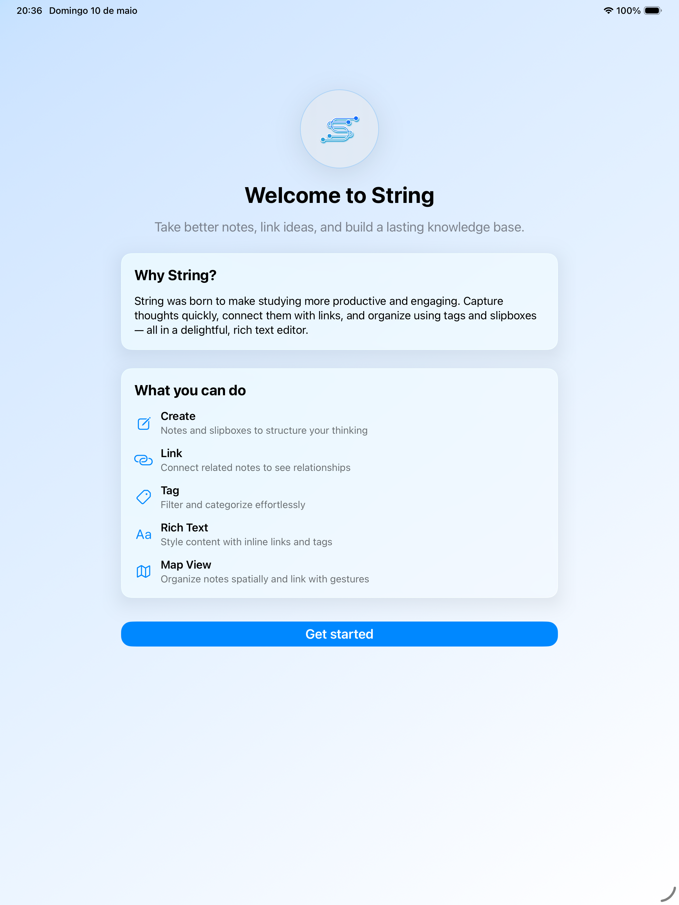
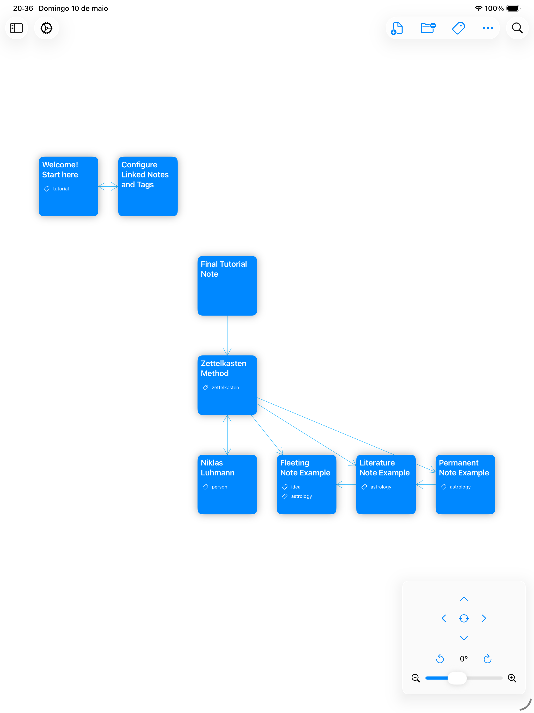
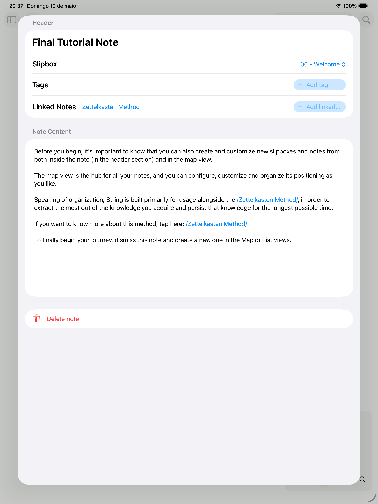
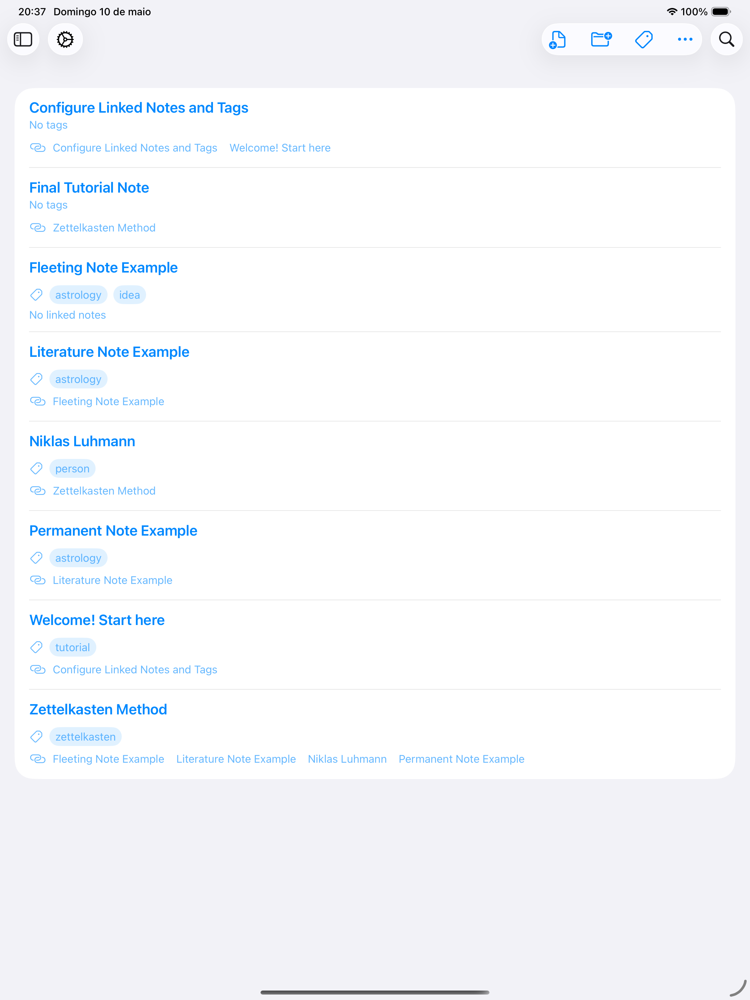

<h1 align="center">
    
</h1>

  <i align="center">Take better notes, <b>link ideas</b>, and build a lasting knowledge base.</i>

  
  
  

## Introduction

String is an **iOS and iPadOS app** built on Swift Playgrounds for the **Swift Student Challenge 2026**.

Designed for users unfamiliar with advanced note-taking tools, String brings the power of a **Zettelkasten system** to everyone — with a strong focus on accessibility and an intuitive, gesture-driven interface. Create notes, link them visually, and organize everything into nested slipboxes.

## Screenshots

Screenshots

 

    
&nbsp;
    

    
&nbsp;
    

## Development

- **Architecture & Patterns**: The project uses **MVVM** to separate UI from business logic, with SwiftData handling persistence via `@Model` classes (`Note`, `Slipbox`, `Tag`) and their bidirectional relationships.
- **Frameworks**: Built entirely with **SwiftUI** and **SwiftData**. Custom `UIGestureRecognizer` subclasses power the multi-touch canvas — supporting simultaneous pan, pinch, and rotate gestures for the Map View.
- **Accessibility**: A core design pillar. The app adapts its entire layout for **VoiceOver** (switching from Map View to a fully accessible List View), and exposes meaningful labels and hints for every interactive element.

## License

String is available under the [MIT License](./LICENSE).
